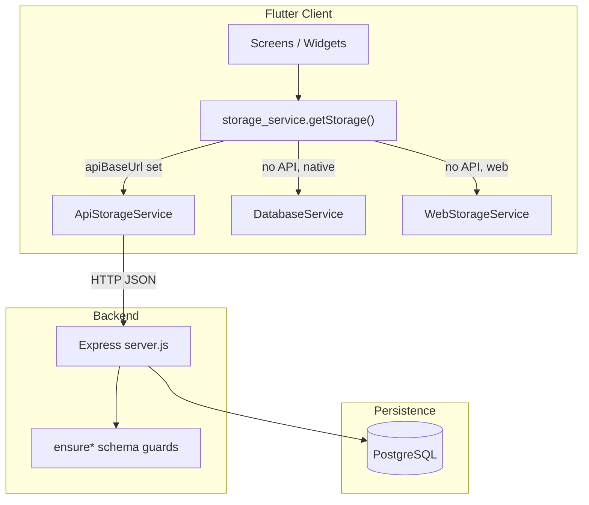
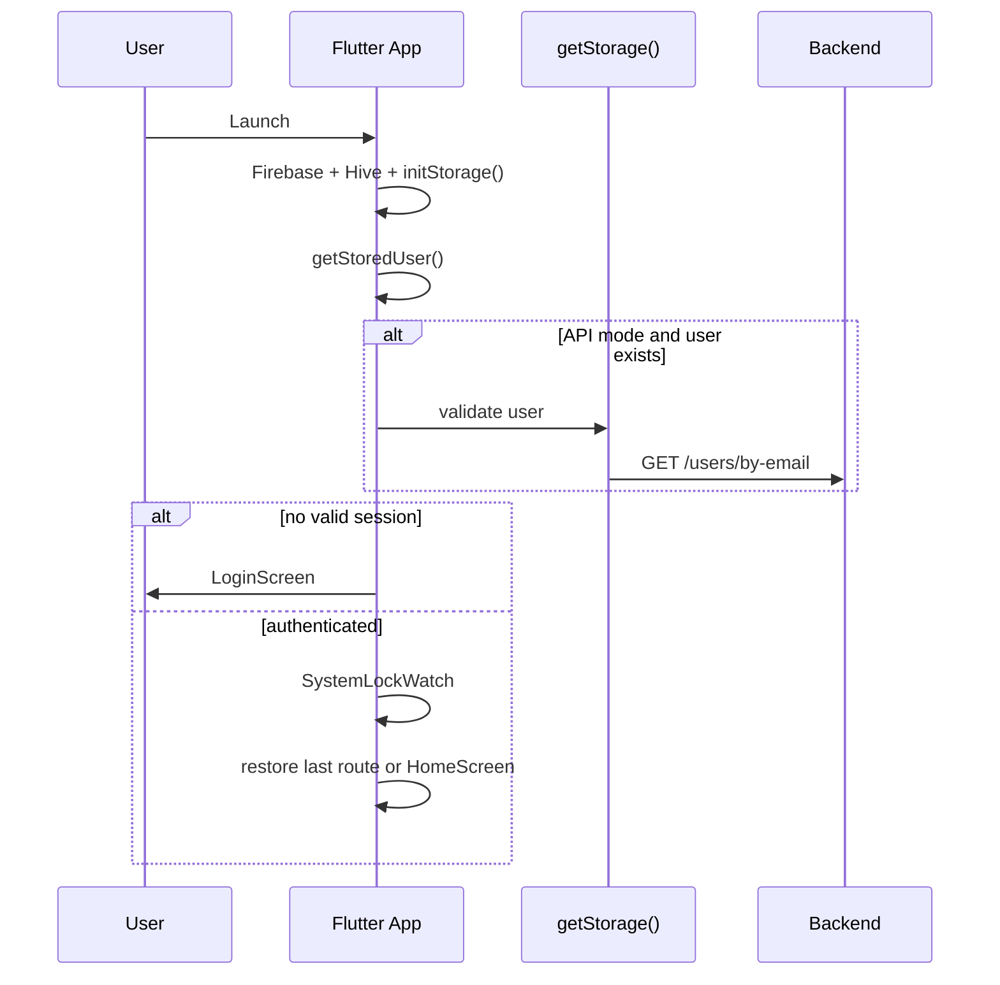

# Wood & More Application — Complete Technical Documentation

> **Document version:** 2026-05-17  
> **Repository:** `wood_and_more_app`  
> **Audience:** Developers, DevOps, and AI agents onboarding to this codebase  
> **Scope:** Read-only analysis of the full project — no application logic was modified to produce this document.

---

## Table of Contents

1. [Project Overview](#1-project-overview)
2. [System Architecture](#2-system-architecture)
3. [Folder Structure Explanation](#3-folder-structure-explanation)
4. [Features Breakdown](#4-features-breakdown)
5. [User Flow](#5-user-flow)
6. [API / Backend Integration](#6-api--backend-integration)
7. [Data Models](#7-data-models)
8. [State Management](#8-state-management)
9. [External Services](#9-external-services)
10. [Environment Setup](#10-environment-setup)
11. [Deployment Notes](#11-deployment-notes)

---

## 1. Project Overview

### 1.1 What the application does

**Wood & More** is a **role-based construction operations platform** for Wood & More field and office teams. It digitizes day-to-day site work across wood/WPC cladding and related trades:

- **Attendance** with geolocation
- **Work plans** for today and tomorrow (confirm, edit, postpone, fines)
- **Operational reports** (inspection, status proof, damage)
- **Detailed daily reports** (structured work lines by project location, phase, contractor, workers)
- **Legacy multi-step daily reports** (still in codebase)
- **Project structure** (projects → zones → buildings → units; parallel tree of `project_locations`)
- **Warehouse & materials** (project stock, location staging, withdrawal with approval workflow)
- **Engineer finances** (balance, custody, movements)
- **IR / MIR document uploads** per project and work site
- **In-app notifications** and limited private admin chat
- **Administration** (users, master data, system lock, icon visibility, activity logs)

The system ships as:

| Component | Technology | Location |
|-----------|------------|----------|
| Client | Flutter (Dart) | `lib/` |
| API | Node.js + Express | `backend/server.js` |
| Database | PostgreSQL | `backend/init-db.sql`, `backend/migrations/` |
| Optional local fallback | SQLite (mobile/desktop) or SharedPreferences (web) | `lib/services/` |

Supported client platforms: **Web**, **Android**, **iOS**, **Windows**, **Linux**, **macOS** (via standard Flutter runners).

### 1.2 Core purpose and business logic

The app replaces paper/spreadsheet workflows with a single source of truth when **`apiBaseUrl`** is configured:

1. **Site engineers** execute and report work; their expenses reduce personal balance; material usage can reduce project stock.
2. **Project managers** (`site_engineer_manager`) approve withdrawals, resolve postpone fines, and review reports.
3. **Operation managers** (`operation_manager`) share withdrawal approval and access postpone/fine analytics.
4. **Accountants** manage custody and balances.
5. **App admins** maintain master data, project trees, warehouse structure, and system settings.

**Business rules highlights:**

- Login uses email + password stored in PostgreSQL (plain text comparison on server).
- **System lock** blocks all users except the primary admin email during maintenance.
- **Withdrawal requests** require dual approval (SEM + OM) before physical withdrawal is recorded.
- **Postponed work plans** trigger SEM fine decisions, then notify OM.
- **Reference data** (projects, contractors, supervisors, zones) must come from storage/API — not hardcoded lists in UI (see `.cursor/rules/reference-data.mdc`).

---

## 2. System Architecture

### 2.1 High-level architecture



### 2.2 Storage strategy (central design decision)

At startup, `initStorage()` in `lib/services/storage_service.dart` selects **one** implementation:

| Condition | Implementation | Persistence |
|-----------|----------------|-------------|
| `apiBaseUrl` in config | `ApiStorageService` | Remote PostgreSQL via REST |
| No API + Web | `WebStorageService` | Browser SharedPreferences JSON |
| No API + Mobile/Desktop | `DatabaseService` | SQLite `wood_and_more.db` v30 |

**Config sources:**

- Web: `GET /config.json` (same origin; Docker mounts `config.api.json`)
- Mobile/Desktop: `assets/config.json` bundled at build time

All three implementations expose the **same method surface** (duck typing via `dynamic getStorage()`).

### 2.3 Component interaction

1. **`main.dart`** — `WidgetsFlutterBinding` → Firebase init (non-fatal on failure) → Hive (`LocalCacheService`) → `initStorage()` → `runApp`.
2. **`_AuthGate`** — Restores session from `auth_persistence`; in API mode validates user still exists via `/users/by-email`.
3. **`SystemLockWatch`** — Polls `/system-lock` every 30s; signs out non-bypass users if locked.
4. **`HomeScreen`** — Loads per-role icon visibility + per-user icon order → `ReorderableHomeScreen`.
5. **Screen action** → `getStorage().method()` → (API) HTTP → `server.js` handler → SQL → JSON response → Dart model → UI.

### 2.4 Backend architecture

- **Monolithic** `backend/server.js` (~3,600 lines): all routes, business logic, and startup DDL helpers.
- **`pg` connection pool** — `DATABASE_URL` (Neon/cloud) or `PGHOST`/`PGPORT`/etc.
- **No JWT/session middleware** — client sends `userId`, `requesterEmail`, or body fields; selective per-route authorization.
- **`ensure*()` functions** on startup create/alter critical tables (notifications, withdrawal_requests, executed_plans extensions, etc.).
- **`migrations/*.sql`** — manual incremental scripts; **not** auto-run by the server (operators run on existing DBs).

### 2.5 Security model (as implemented)

| Mechanism | Behavior |
|-----------|----------|
| Authentication | `POST /auth/login` returns user profile; client stores locally |
| Authorization | Per-endpoint checks (role, email match, requester id) |
| Primary admin | `mouhammedhelal@gmail.com` — system lock, activity logs, icon control, hidden from other users' lists |
| Passwords | Plain text in `users.password` (default `0000`) |
| Activity audit | Middleware logs most requests to `activity_logs` |

**Production hardening gaps:** token-based auth, password hashing, centralized auth middleware, HTTPS enforcement.

---

## 3. Folder Structure Explanation

### 3.1 Repository root

| Path | Responsibility |
|------|----------------|
| `lib/` | Flutter application source (~118 Dart files) |
| `backend/` | Node.js API, SQL schema, migrations, ops scripts |
| `assets/` | Images, `config.json` (API URL for native builds) |
| `web/` | Web entrypoint, `index.html`, web `config.json` |
| `android/`, `ios/`, `windows/`, `linux/`, `macos/` | Platform runners and build config |
| `test/` | Flutter unit tests |
| `docker-compose.yml` | Postgres (optional profile) + API + Flutter web/nginx |
| `Dockerfile` | Flutter web build served by nginx |
| `config.api.json` | API URL injected into web container |
| `pubspec.yaml` | Flutter dependencies and assets |
| `README.md` | Windows/local PostgreSQL setup guide |
| `APK.md` | Android release APK build instructions |
| `DEPLOYMENT_GUIDE.md`, `BUILD_SIGN_README.md`, `RELEASE_APK_STEPS.md` | Deployment notes |
| `.cursor/rules/` | AI/editor rules (e.g. reference data policy) |
| `.agents/skills/` | Agent skill metadata |

### 3.2 `lib/` — Flutter application

| Folder | Files | Responsibility |
|--------|------:|----------------|
| `screens/` | 60 | Full-screen UI flows by role |
| `services/` | 16 | Storage, auth, routes, business helpers |
| `models/` | 26 | Domain entities (`fromMap` / `toMap`) |
| `widgets/` | 4 | Reusable UI components |
| `utils/` | 4 | PDF share (IO/stub), image compression |
| `data/` | 2 | Default/priority material names and sort order |
| `core/` | 2 | Theme, route observer |
| Root | 8 | `main.dart`, Firebase options, print stubs |

**Key root files:**

| File | Role |
|------|------|
| `main.dart` | App bootstrap, auth gate, route restore, localization |
| `firebase_options.dart` | Firebase platform config scaffold |

### 3.3 `lib/services/` — Data & cross-cutting

| Service | Purpose |
|---------|---------|
| `storage_service.dart` | Facade: API vs web vs SQLite selection |
| `api_storage_service.dart` | REST client (~1,600 lines) mirroring all domain operations |
| `database_service.dart` | SQLite offline mirror, schema v30, migrations in `_onUpgrade` |
| `web_storage_service.dart` | SharedPreferences JSON entity stores + seeds |
| `auth_persistence.dart` | Current user + session in SharedPreferences |
| `route_persistence.dart` / `route_restore.dart` | Last route save/restore; route name → widget map |
| `system_lock_service.dart` | Maintenance lock check and forced sign-out |
| `icon_visibility_service.dart` | Per-role home icon definitions and defaults |
| `home_icon_order_service.dart` | Merge saved order with eligible icons |
| `location_service.dart` | Geolocator wrapper for attendance |
| `project_warehouse_loading.dart` | Batch load/index warehouse by location+phase |
| `withdrawal_stock_validation.dart` | Pre-withdrawal stock validation |
| `local_cache_service.dart` | Hive TTL cache (e.g. daily movement) |
| `operation_reports_store.dart` | Local ValueNotifier + prefs for operation tracking UI |
| `last_project_persistence.dart` | Remember last selected project |

### 3.4 `lib/screens/` — Complete inventory by domain

#### Auth & shell

| Screen | Purpose |
|--------|---------|
| `animated_logo_splash_screen.dart` | Entry splash animation |
| `login_screen.dart` | Email/password login; maintenance lock UI |
| `home_screen.dart` | Role home: notifications badge, withdrawal count, chat entry |
| `reorderable_home_screen.dart` | Drag-to-reorder home icons |

#### Site engineer

| Screen | Purpose |
|--------|---------|
| `attendance_screen.dart` | Check-in/out + GPS + project |
| `today_work_plan_screen.dart` | View/execute today's plan |
| `tomorrow_work_plan_screen.dart` | Plan tomorrow; worker distribution |
| `detailed_report_screen.dart` | Primary "daily report": sites, phases, contractors, attachments |
| `detailed_report_finances_screen.dart` | Expense lines for detailed report |
| `site_engineer_finances_entry_screen.dart` | Finances linked to work plan |
| `operation_reports_screen.dart` | Inspection / status / damage reports + photos |
| `engineer_withdraw_materials_screen.dart` | Warehouse withdrawal per sub-location |
| `withdrawal_balance_review_screen.dart` | Stock review before withdrawal |
| `engineer_projects_screen.dart` | Project → zone → building → materials/cutlists |
| `ir_mir_screen.dart` | Upload/view MIR and IR documents |
| `site_engineer_reports_screen.dart` | Placeholder (disabled) |
| `daily_report_step1/2/3_screen.dart` | Legacy wizard (route restore only) |

#### Project manager (`site_engineer_manager`)

| Screen | Purpose |
|--------|---------|
| `attendance_reports_screen.dart` | All engineers' attendance; PDF |
| `work_plan_tracking_report_screen.dart` | Today/tomorrow plan tracking table |
| `new_icon_screen.dart` | Today plan status + tomorrow readiness summary |
| `operation_reports_tracking_screen.dart` | Track engineers' operation reports |
| `aggregated_detailed_daily_report_screen.dart` | Aggregated detailed reports + withdrawals |
| `contractor_report_screen.dart` | Contractor worker counts from confirmed plans |
| `manager_withdrawal_requests_screen.dart` | Approve/reject withdrawal requests; postpone queue |
| `manager_custody_screen.dart` | Custody entry and reports |
| `finance_screen.dart` | Balances, custody, engineer expenses |
| `warehouses_view_screen.dart` | Read-only warehouse view |
| `notifications_screen.dart` | In-app notification inbox |
| `ir_mir_screen.dart` | View engineers' uploads |

#### Operation manager

Same manager screens where configured, plus:

| Screen | Purpose |
|--------|---------|
| `postpone_fines_report_screen.dart` | Postpone/fine analytics with filters and PDF |

#### Accountant

| Screen | Purpose |
|--------|---------|
| `accountant_custody_screen.dart` | Custody by user/period; PDF |
| `accountant_finance_screen.dart` | Balances; add/withdraw; movement report |

#### App admin

| Screen | Purpose |
|--------|---------|
| `admin_dashboard_screen.dart` | Admin hub + system lock toggle |
| `admin_users_screen.dart` | User CRUD |
| `admin_projects_screen.dart` | Project CRUD |
| `admin_zones_screen.dart` | Zones per project |
| `admin_buildings_screen.dart` | Buildings per zone |
| `admin_units_screen.dart` | Units per building |
| `admin_building_materials_screen.dart` | Tashweenat per building |
| `admin_cutlists_screen.dart` | Cutlist images |
| `admin_supervisors_screen.dart` | Supervisors |
| `admin_contractors_screen.dart` | Contractors |
| `admin_materials_screen.dart` | Global material catalog |
| `admin_project_stores_screen.dart` | Project stock balances |
| `admin_warehouse_structure_screen.dart` | Location tree + materials per site |
| `admin_location_materials_screen.dart` | Materials for one sub-location |
| `admin_warehouse_withdraw_screen.dart` | Cancel withdrawal / restore stock |
| `admin_project_structure_screen.dart` | `project_locations` tree |
| `activity_logs_screen.dart` | API activity audit (restricted email) |
| `icons_control_screen.dart` | Toggle home icons per role |
| `daily_movement_screen.dart` | Daily plan execute/edit/postpone summary |
| `reports_screen.dart` | Filter legacy daily reports |
| `salary_deduction_screen.dart` | Salary deduction PDF form |
| `dashboard_screen.dart` | Demo management dashboard (static mock) |

#### Shared reports

| Screen | Purpose |
|--------|---------|
| `workers_report_screen.dart` | Worker counts by filters; PDF |
| `user_custody_report_screen.dart` | Custody movements; PDF |
| `attendance_sub_report_screen.dart` | Attendance movements; PDF |
| `sub_reports_screen.dart` | Hub for sub-reports (**not wired** in current navigation) |

### 3.5 `backend/`

| Path | Purpose |
|------|---------|
| `server.js` | Express API (111 routes) |
| `package.json` | `express`, `pg`, `cors`, `dotenv` |
| `init-db.sql` | Full schema + seed users/projects/materials |
| `01-create-database.sql` / `00-drop-database.sql` | DB lifecycle utilities |
| `migrations/*.sql` | Incremental schema (manual apply) |
| `scripts/*.js`, `*.sql` | Data sync, purge, project-specific seeds |
| `Dockerfile` | Node 20 Alpine API image |
| `.env.example` | `DATABASE_URL` / `PG*` template |
| `README-DATABASE.md` | Arabic DB setup guide |

### 3.6 Platform runners

Standard Flutter multi-platform layout. Build artifacts under `build/` per platform. Android uses adaptive icon from `assets/images/logo.png` (`#1B5E20` background).

---

## 4. Features Breakdown

For each feature: **user perspective** (what people see) and **system perspective** (how it is implemented).

### 4.1 Authentication & session

| | |
|---|---|
| **User** | Log in with email/password; session persists; on refresh, returns to last screen when possible. |
| **System** | `POST /auth/login`; `auth_persistence` stores `UserModel`; API mode re-validates via `/users/by-email`; `SystemLockWatch` enforces maintenance mode. |

### 4.2 System maintenance lock

| | |
|---|---|
| **User** | Admin toggles lock; other users see maintenance message and cannot use the app (live sessions signed out). |
| **System** | `app_settings.system_locked`; `GET/PUT /system-lock`; bypass for `mouhammedhelal@gmail.com`; HTTP 423 on login when locked. |

### 4.3 Configurable home screen

| | |
|---|---|
| **User** | Icon grid on home; long-press drag to reorder (per user); admin can hide icons per role. |
| **System** | `IconVisibilityService.roleIcons`; `user_home_icon_orders`; `/home-icons-visibility`, `/users/:id/home-icon-order`; `ReorderableHomeScreen` + `HomeIconBuilder`. |

### 4.4 Attendance

| | |
|---|---|
| **User** | Engineer records arrival/departure with project, notes, and map location. Managers view/filter reports and export PDF. |
| **System** | `attendance_records`; `POST /attendance` notifies managers; `geolocator` + `url_launcher` for maps; `location_service.dart`. |

### 4.5 Work plans (today / tomorrow)

| | |
|---|---|
| **User** | Engineer views today's assigned plan; plans tomorrow with lines (contractor, location, workers, phases). Can confirm, edit, or **postpone** with reason, reopen date, and fine suggestion. |
| **System** | Plans stored as `executed_plans` with `plan_json`; statuses `confirmed` \| `confirmed_edited` \| `postponed`; `postpone_reasons` catalog; SEM resolves fines via `/executed-plans/:id/sem-fine-resolution`; notifications to SEM/OM. |

### 4.6 Operation reports

| | |
|---|---|
| **User** | Engineer submits inspection/status/damage reports with photos; managers track completion. |
| **System** | `operation_reports_screen.dart` + `operation_reports_tracking_screen.dart`; `OperationReportsStore` for local tracking state; animated home card for quick access. |

### 4.7 Detailed daily report ("التقرير اليومي")

| | |
|---|---|
| **User** | Multi-line report: project or custom name, work sites from `project_locations`, contractors, multiple **phases per site** (worker count can copy from previous phase), optional attachments and expenses. |
| **System** | `detailed_reports` + `detailed_report_lines`; `POST /detailed-reports` deducts expenses from `engineer_balance`; `workers_count >= 0`; aggregated views join withdrawals. |

> **Reporting note:** When aggregating contractor worker counts, do not sum line-level `workers_count` across phases for the same crew — use max-per-site or count crew once per policy.

### 4.8 Legacy daily report wizard

| | |
|---|---|
| **User** | Three-step flow (basics → materials → expenses) — not on current home icons. |
| **System** | `daily_reports` table; `POST /daily-reports` deducts expenses and materials from stock + ledger; reachable via saved route `daily-report`. |

### 4.9 Finances & custody

| | |
|---|---|
| **User** | Accountant/manager views balances, records custody handover, add/withdraw movements; engineers see own finances; PDF exports. |
| **System** | `engineer_balance`, `engineer_custody` (with `movement_type`, `document_path`); `/engineer-balance`, `/custody`, `/balance-movement`. |

### 4.10 Project structure (admin)

| | |
|---|---|
| **User** | Admin maintains projects, zones, buildings, units, supervisors, contractors, building materials, cutlists. |
| **System** | CRUD endpoints for each entity; cascade rules on project delete (stock, locations, zones). |

### 4.11 Project locations tree

| | |
|---|---|
| **User** | Admin builds folder/work_site tree used in detailed reports and warehouse. |
| **System** | `project_locations` (`parent_id`, `type`, `display_order`); used by detailed report lines and location materials. |

### 4.12 Project warehouse & stock

| | |
|---|---|
| **User** | Admin sets project-level stock; structures materials per sub-location and phase (`first_fix`, `second_fix`); engineers withdraw with dispatch/delivery documents. |
| **System** | `project_stock`, `project_stock_ledger`; `location_materials`, `location_withdrawal`; `project_warehouse_loading.dart` indexes by `locationId_phase`. |

### 4.13 Withdrawal request workflow

| | |
|---|---|
| **User** | Engineer requests withdrawal → SEM and OM each approve/reject → engineer performs physical withdrawal → optional fulfill marker. Badge on home for pending actions. |
| **System** | `withdrawal_requests` with `sem_status`, `om_status`, `overall_status`; `/withdrawal-requests/*`; notifications on state changes; `POST /location-withdrawal` can auto-fulfill approved request. |

### 4.14 IR / MIR uploads

| | |
|---|---|
| **User** | Engineer uploads MIR/IR files tied to project, location, phase; managers view; primary admin can delete. |
| **System** | `ir_mir_uploads` (base64 in DB); `/ir-mir/uploads`; `IrMirUploadModel`. |

### 4.15 Notifications

| | |
|---|---|
| **User** | Bell icon with unread count; list of events (attendance, withdrawals, plan postpone, etc.). |
| **System** | `notifications` table; inserted by server on domain events; `/notifications`, `/notifications/unread-count`, mark read. |

### 4.17 Reporting & PDF export

| | |
|---|---|
| **User** | Many screens export/share PDF reports (attendance, custody, contractors, plans, fines, etc.). |
| **System** | `pdf`, `printing`, `share_plus`; `lib/utils/pdf_share.dart` with IO/stub conditional import. |

### 4.18 Activity audit

| | |
|---|---|
| **User** | Primary admin views filtered API activity log. |
| **System** | Middleware on `res.finish` → `activity_logs`; `GET /activity-logs` (email-gated). |

### 4.19 Materials catalog & display order

| | |
|---|---|
| **User** | Materials appear in consistent priority order (Terrace Zayed WPC/ALU first, then others). |
| **System** | `lib/data/materials_display.dart` — `priorityMaterialNames`, `sortMaterialsForDisplay()`; seeds in `init-db.sql` and migration `012_terrace_zayed_materials_and_stock.sql`. |

---

## 5. User Flow

### 5.1 Application bootstrap



### 5.2 Site engineer — typical day

1. **Login** → home icon grid (personal order if saved).
2. **Attendance** — check-in with GPS and project.
3. **Today work plan** — review plan; confirm, edit, or postpone (if postpone: reason + reopen date + fine target).
4. **Detailed report** — enter work lines per site/phase/contractor; attachments; finances screen for expenses.
5. **Operation report** (if required) — inspection/damage with photos.
6. **Withdrawal** — request materials for location+phase → wait for SEM+OM approval → withdraw with documents → stock deducted.
7. **IR/MIR** — upload documents for completed work sites.
8. **Logout** or leave app (route saved for next launch).

### 5.3 Project manager — typical day

1. Login → review **notification badge** and **withdrawal/postpone action count**.
2. **Pending withdrawal requests** — approve or reject (SEM side).
3. **Pending postpone fine actions** — set fine target, amount, or no-fine reason.
4. **Work plan tracking report** — filter engineers/projects/dates.
5. **Operation reports tracking** — monitor engineer submissions.
6. **Aggregated detailed daily report** — review combined field data.
7. **Attendance reports** — review/export PDF.
8. **Warehouses view** — read-only stock after withdrawals.

### 5.4 Operation manager

Same as manager for withdrawals and tracking, plus **postpone fines report** with date/engineer/project/contractor filters and PDF export.

### 5.5 Accountant

1. Login → **Custody** or **Finance** icons only.
2. Filter by user and period → review movements → export PDF.
3. Add balance or record custody handover.

### 5.6 App admin

1. Login → extended icon set including **Admin dashboard**, **Project structure**, **Daily movement**, **Activity logs** (if email allowed).
2. CRUD master data via dashboard links.
3. Toggle **system lock** when deploying maintenance.
4. Optional: **Icons control** — hide features per role without redeploying.

### 5.7 Route persistence

- `route_persistence.dart` saves route name on navigation (`pushAndSaveRoute`).
- On cold start, `getScreenForRoute()` rebuilds deep-linked screen with back → home.
- Supported routes include: `attendance`, `detailed-report`, `today-work-plan`, `admin-dashboard`, `operation-reports-tracking`, etc. (see `route_restore.dart`).

---

## 6. API / Backend Integration

### 6.1 Stack

- **Runtime:** Node.js (Docker: Node 20 Alpine)
- **Framework:** Express 4 + `cors` + JSON body (10 MB limit)
- **DB client:** `pg` with connection pool
- **Config:** `dotenv` from `backend/.env`

### 6.2 Environment variables

| Variable | Purpose |
|----------|---------|
| `DATABASE_URL` | Full connection string (Neon: include SSL) |
| `PGHOST`, `PGPORT`, `PGDATABASE`, `PGUSER`, `PGPASSWORD` | Used when `DATABASE_URL` unset |
| `PORT` | API listen port (default `3000`) |

SSL auto-enabled when URL contains `sslmode=require` or `neon.tech`.

### 6.3 Complete endpoint catalog (111 routes)

#### Health & authentication

| Method | Path | Description |
|--------|------|-------------|
| GET | `/` | API health/info |
| POST | `/auth/login` | Login; 423 if system locked |

#### System & UI configuration

| Method | Path | Description |
|--------|------|-------------|
| GET | `/system-lock` | Read maintenance flag |
| PUT | `/system-lock` | Set lock (primary admin) |
| GET | `/home-icons-visibility` | Per-role icon visibility JSON |
| PUT | `/home-icons-visibility/:role` | Update visibility for role |
| GET | `/users/:id/home-icon-order` | User icon order |
| PUT | `/users/:id/home-icon-order` | Save icon order |

#### Users

| Method | Path | Description |
|--------|------|-------------|
| GET | `/users/by-email` | Lookup by email |
| GET | `/users` | List users |
| GET | `/users/site-engineers` | Engineers only |
| POST | `/users` | Create (default password `0000`) |
| PUT | `/users/:id` | Update |
| DELETE | `/users/:id` | Delete |

#### Projects & spatial hierarchy

| Method | Path | Description |
|--------|------|-------------|
| GET/POST | `/projects` | List/create |
| PUT/DELETE | `/projects/:id` | Update/delete |
| GET/POST | `/project-locations` | Location tree |
| PUT/DELETE | `/project-locations/:id` | Update/delete location |
| GET/POST/PUT/DELETE | `/zones`, `/zones/:id` | Zones |
| GET/POST/PUT/DELETE | `/buildings`, `/buildings/:id` | Buildings |
| GET/POST/PUT/DELETE | `/units`, `/units/:id` | Units |
| GET/POST/PUT/DELETE | `/building-materials`, `.../:id` | Building tashweenat |
| GET/POST/DELETE | `/building-cutlists`, `.../:id` | Cutlist images |

#### Attendance

| Method | Path | Description |
|--------|------|-------------|
| POST | `/attendance` | Create; notifies managers |
| GET | `/attendance` | List (filters) |
| GET | `/attendance/by-user/:userId` | Per user |
| DELETE | `/attendance/:id` | Delete |

#### Notifications & chat

| Method | Path | Description |
|--------|------|-------------|
| GET | `/notifications` | Inbox for userId |
| GET | `/notifications/unread-count` | Badge count |
| PUT | `/notifications/:id/read` | Mark read |


#### IR / MIR

| Method | Path | Description |
|--------|------|-------------|
| GET | `/ir-mir/uploads` | List (filters) |
| POST | `/ir-mir/uploads` | Upload base64 payload |
| DELETE | `/ir-mir/uploads/:id` | Delete |

#### Materials & reports

| Method | Path | Description |
|--------|------|-------------|
| GET/POST/PUT/DELETE | `/materials`, `/materials/:id` | Catalog |
| GET | `/materials/with-ids` | With database ids |
| POST/GET/DELETE | `/daily-reports` | Legacy daily reports |
| GET | `/work-phases` | Standard phases |
| POST/GET | `/detailed-reports` | Create/list detailed |
| PUT | `/detailed-reports/:id` | Full update |
| PUT | `/detailed-reports/:id/expenses` | Expenses only |
| DELETE | `/detailed-reports/:id` | Delete |

#### Finance

| Method | Path | Description |
|--------|------|-------------|
| GET | `/engineer-balance/:userId` | Balance |
| POST | `/engineer-balance` | Set balance |
| POST | `/custody` | Custody handover |
| POST | `/balance-movement` | Log movement |
| GET | `/custody` | History |

#### Supervisors & contractors

| Method | Path | Description |
|--------|------|-------------|
| GET/POST/PUT/DELETE | `/supervisors`, `/supervisors/:id` | Supervisors |
| GET/POST/PUT/DELETE | `/contractors`, `/contractors/:id` | Contractors |

#### Stock & warehouse

| Method | Path | Description |
|--------|------|-------------|
| GET/POST/PUT/DELETE | `/project-stock`, `/project-stock/:id` | Project stock |
| POST/GET | `/project-stock-ledger` | Ledger append/query |
| GET/POST/PUT/DELETE | `/location-materials`, `.../:id` | Staged materials |
| GET | `/location-withdrawal` | Withdrawal by location |
| GET | `/location-withdrawals-for-period` | Period report |
| POST | `/location-withdrawal` | Execute withdrawal |
| DELETE | `/location-withdrawal` | Reverse (admin) |

#### Withdrawal requests

| Method | Path | Description |
|--------|------|-------------|
| POST | `/withdrawal-requests` | Engineer creates request |
| GET | `/withdrawal-requests/for-engineer-project` | Engineer's open requests |
| GET | `/withdrawal-requests/open` | Open for location+phase |
| GET | `/withdrawal-requests/action-count` | Badge (SEM includes fines) |
| GET | `/withdrawal-requests/pending-actions` | SEM/OM queue |
| PUT | `/withdrawal-requests/:id/respond` | Approve/reject |
| PUT | `/withdrawal-requests/:id/fulfill` | Mark fulfilled |

#### Executed work plans

| Method | Path | Description |
|--------|------|-------------|
| POST | `/executed-plans` | Confirm/edit/postpone |
| GET | `/executed-plans/pending-sem-fine-actions` | SEM fine queue |
| GET | `/executed-plans/postpone-fines-report` | Analytics (OM/admin) |
| POST | `/executed-plans/:id/sem-fine-resolution` | SEM fine decision |
| GET | `/executed-plans/latest` | Latest by sourcePlanId+user |
| GET | `/executed-plans/postponed-reopens` | Plans reopening on date |
| GET | `/executed-plans/daily-summary` | Admin daily counts |
| GET | `/executed-plans/contractor-report` | Worker stats from plans |
| GET | `/postpone-reasons` | Reason catalog |

#### Audit

| Method | Path | Description |
|--------|------|-------------|
| GET | `/activity-logs` | Filtered audit (primary admin email) |

### 6.4 Frontend ↔ backend data flow

```
UI event
  → getStorage().<method>(...)
    → ApiStorageService: http.get/post/put/delete
      → Express route handler
        → pool.query(...)  // business rules inline
          → JSON response
    → Model.fromMap(json)
  → setState / FutureBuilder rebuild
```

**Side effects enforced server-side:**

| Action | Side effect |
|--------|-------------|
| Create daily report | Deduct expenses from balance; deduct materials from stock + ledger |
| Create detailed report | Deduct expenses from balance |
| Location withdrawal | Deduct stock; ledger entry; may fulfill withdrawal request |
| Postpone work plan | Insert notification for SEM |
| SEM fine resolution | Insert notification for OM |

### 6.5 Roles in API seed data

`site_engineer`, `site_engineer_manager`, `operation_manager`, `app_admin`, `accountant`

---

## 7. Data Models

### 7.1 PostgreSQL entities (primary)

| Table | Description |
|-------|-------------|
| `users` | id, name, email, role, password |
| `app_settings` | key-value (`system_locked`, `home_icons_visibility`) |
| `projects` | Project master |
| `attendance_records` | Check-in/out events |
| `notifications` | In-app notifications per recipient |
| `materials` | Global material name catalog |
| `daily_reports` | Legacy daily reports (JSON columns for materials/expenses/contractors) |
| `project_locations` | Tree: folder \| work_site |
| `zones`, `buildings`, `units` | Classic hierarchy |
| `supervisors`, `contractors` | Reference lists |
| `project_stock` | Quantity per project+material |
| `project_stock_ledger` | Stock movement audit |
| `building_materials`, `building_cutlist_images` | Per-building data |
| `engineer_balance` | Current balance per engineer |
| `engineer_custody` | Custody/movement history |
| `work_phases` | Standard phase names |
| `detailed_reports` | Report header |
| `detailed_report_lines` | Lines: contractor, location, phase, workers_count, zone/building refs |
| `location_materials` | Materials at location + phase |
| `location_withdrawal` | One withdrawal record per location+phase |
| `withdrawal_requests` | Approval workflow state |
| `executed_plans` | Work plan executions + postpone/fine fields |
| `postpone_reasons` | System and custom postpone reasons |
| `ir_mir_uploads` | File metadata + base64 payload |
| `user_home_icon_orders` | Per-user icon order JSON |
| `activity_logs` | API request audit trail |

### 7.2 Flutter models (`lib/models/`)

| Model | Maps to |
|-------|---------|
| `UserModel` | users + capability getters |
| `ProjectModel`, `ZoneModel`, `BuildingModel`, `UnitModel` | Spatial hierarchy |
| `ProjectLocationModel` | project_locations tree |
| `AttendanceRecordModel` | attendance_records |
| `DailyReportData` (+ nested types) | daily_reports |
| `DetailedReportModel`, lines, attachments | detailed_reports |
| `WorkPhaseModel` | work_phases |
| `SupervisorModel`, `ContractorModel` | Reference data |
| `ProjectStockModel`, `ProjectStockLedgerModel` | Warehouse |
| `LocationMaterialModel`, `LocationWithdrawalModel`, `LocationWithdrawalForPeriodModel` | Site warehouse |
| `WithdrawalRequestModel` | withdrawal_requests |
| `NotificationItemModel` | notifications |
| `IrMirUploadModel` | ir_mir_uploads |
| `ActivityLogModel` | activity_logs |
| `PendingPostponeFineActionModel`, `PostponeFineReportRowModel` | Plan postpone UI |
| `BuildingMaterialModel`, `BuildingCutlistModel` | Building-level data |

### 7.3 Schema evolution

**Automatic (server startup `ensure*`):** activity_logs, executed_plans columns, postpone_reasons, notifications, withdrawal_requests, ir_mir_uploads, user_home_icon_orders, work_phases, project_locations, detailed report tables, location warehouse tables, password column.

**Manual migrations (`backend/migrations/`):**

| File | Change |
|------|--------|
| `001_add_engineer_custody_movement_type.sql` | Custody movement types |
| `002_add_daily_reports_contractors_json.sql` | contractors_json |
| `002_user_home_icon_order.sql` | user_home_icon_orders |
| `003_detailed_reports.sql` | Detailed report tables |
| `004_project_locations.sql` | Location tree |
| `005_detailed_reports_summary_and_location.sql` | Summary + location on lines |
| `006_detailed_reports_project_name.sql` | Custom project name |
| `007_location_materials_and_withdrawal.sql` | Site warehouse |
| `008_detailed_report_phases_and_contractor_nullable.sql` | Phase + nullable contractor |
| `008_ir_mir_uploads.sql` | IR/MIR table |
| `009_executed_plans_postpone_reopen_date.sql` | postpone_reopen_date |
| `011_allow_zero_workers_count.sql` | workers_count >= 0 |
| `012_terrace_zayed_materials_and_stock.sql` | Terrace Zayed WPC/ALU stock seed |

---

## 8. State Management

### 8.1 Pattern summary

The app does **not** use Provider, Riverpod, BLoC, or GetX as a global architecture.

| Mechanism | Usage |
|-----------|--------|
| `StatefulWidget` + `setState` | Primary UI state on ~60 screens |
| `FutureBuilder` | Auth gate loading in `main.dart` |
| `getStorage()` singleton | All domain data reads/writes |
| `SharedPreferences` | Auth session, routes, web entity storage, operation reports store |
| `Hive` | `LocalCacheService` with TTL (e.g. 5 min cache on daily movement) |
| `ValueNotifier` | `OperationReportsStore.reports` only |
| `RouteObserver` + `RouteAware` | `HomeScreen` refreshes on pop |
| `Timer.periodic` | Notifications poll, system lock poll |
| Imperative `Navigator.push` | No `go_router`; route names as strings |

### 8.2 Session & navigation state

| Component | Data persisted |
|-----------|----------------|
| `auth_persistence.dart` | Current `UserModel` JSON |
| `route_persistence.dart` | Last route name string |
| `route_restore.dart` | Maps route → widget constructor |
| `last_project_persistence.dart` | Last selected project id |

### 8.3 Home screen state

1. Load `home_icons_visibility` from API/settings.
2. Load user's `home_icon_order` from API/local.
3. `resolveHomeIconOrder()` merges saved order with eligible icons for role + visibility.
4. `ReorderableHomeScreen` persists new order on drag end.

### 8.4 Storage mode implications

| Mode | State authority |
|------|-----------------|
| API | PostgreSQL is source of truth; client is thin |
| SQLite / Web | Local JSON/SQLite is source of truth; no multi-user sync |

Always confirm `apiBaseUrl` when testing multi-user workflows.

---

## 9. External Services

### 9.1 Packages (`pubspec.yaml`)

| Package | Integration |
|---------|-------------|
| `flutter` + `flutter_localizations` | UI; Arabic (`ar`) default locale |
| `http` | REST API client |
| `sqflite`, `path`, `path_provider` | SQLite offline mode |
| `shared_preferences` | Session, web storage, prefs |
| `hive`, `hive_flutter` | TTL response cache |
| `geolocator` | Attendance GPS |
| `url_launcher` | Open map links from coordinates |
| `pdf`, `printing`, `share_plus` | Report PDF generation and sharing |
| `intl` | Date/number formatting |
| `file_picker` | Attachments (reports, IR/MIR, custody docs) |
| `image` | Image compression before upload |
| `firebase_core`, `cloud_firestore`, `firebase_auth` | Initialized in `main.dart`; **not used elsewhere in `lib/`** currently |
| `cupertino_icons` | Icon font |

### 9.2 Firebase

- `Firebase.initializeApp()` in `main.dart` with non-fatal error handling (web may block `gstatic`).
- Dependencies present for future auth/Firestore; **all business data flows through REST + PostgreSQL** in production configuration.

### 9.3 PostgreSQL hosting

- Designed for **Neon Serverless Postgres** or self-hosted Postgres.
- `DATABASE_URL` with SSL for cloud deployments.
- Docker Compose optional local Postgres via profile `local-db`.

### 9.4 No other third-party SaaS

Maps are opened via URL launcher (not embedded Maps SDK billing). No push notification service (in-app polling only). No Stripe/payment integration.

---

## 10. Environment Setup

### 10.1 Prerequisites

| Tool | Version / notes |
|------|-----------------|
| Flutter SDK | Dart `^3.11.0` per `pubspec.yaml` |
| Node.js | LTS recommended |
| PostgreSQL | 16+ (local, Docker, or Neon) |

Verify:

```bash
flutter doctor
node -v
npm -v
```

### 10.2 Database setup

**Option A — Dedicated database (recommended):**

1. Run `backend/01-create-database.sql` as `postgres` superuser.
2. Connect to database `wood_more`.
3. Run `backend/init-db.sql`.
4. Apply any missing files from `backend/migrations/` on existing deployments.

**Option B — Docker local DB:**

```bash
docker compose --profile local-db up --build
```

Postgres initializes from mounted `init-db.sql`.

### 10.3 Backend

```bash
cd backend
cp .env.example .env   # set DATABASE_URL or PG* vars
npm install
node server.js
```

API listens on **http://localhost:3000** (unless `PORT` overridden).

### 10.4 Flutter client

1. Set API URL:

**Mobile/Desktop** — `assets/config.json`:

```json
{
  "apiBaseUrl": "http://localhost:3000"
}
```

**Web** — `web/config.json` or root `config.api.json` for Docker.

2. Run:

```bash
flutter pub get
flutter run -d chrome
# or
flutter run -d windows
# or connect Android device
flutter run
```

### 10.5 Offline / demo mode

Leave `apiBaseUrl` empty:

- Web → seeded users in `WebStorageService`
- Mobile → SQLite with seeded data in `DatabaseService`

### 10.6 Running tests

```bash
flutter test
```

Notable tests: `test/home_icon_order_service_test.dart`, `test/project_warehouse_loading_test.dart`.

---

## 11. Deployment Notes

### 11.1 Docker Compose (full stack)

From repository root:

```bash
# Cloud DB: set DATABASE_URL in backend/.env
docker compose up --build

# Local Postgres:
docker compose --profile local-db up --build
```

| Service | Port | Role |
|---------|------|------|
| `postgres` | 5432 | DB (profile `local-db` only) |
| `api` | 3000 (internal) | Node API |
| `app` | 8080 → 80 | Flutter web via nginx |

Web app: **http://localhost:8080**  
API config injected via `config.api.json` volume mount.

### 11.2 Backend container

- `backend/Dockerfile` — Node 20 Alpine; copies `server.js` + `package.json` only.
- SQL/migrations **not** in image — apply schema separately on cloud DB.
- Restart API after `server.js` changes.

### 11.3 Flutter web container

- Root `Dockerfile` — multi-stage Flutter build + nginx.
- `nginx.standalone.conf` available for standalone serving patterns.

### 11.4 Android APK

See **`APK.md`**:

```bash
flutter build apk --release
# Output: build/app/outputs/flutter-apk/app-release.apk
```

Rebuild after every `assets/config.json` URL change (bundled at compile time).

Optional smaller builds:

```bash
flutter build apk --release --split-per-abi
```

### 11.5 Operational checklist

| Task | Action |
|------|--------|
| Schema update on Neon | Run relevant `migrations/*.sql` in SQL editor |
| New backend feature | Deploy `server.js`; restart container/process |
| New Flutter feature | Rebuild web/APK; bump version in `pubspec.yaml` if publishing |
| Maintenance window | `PUT /system-lock` or admin dashboard toggle |
| Verify API mode | Confirm `apiBaseUrl` non-empty in built config |

### 11.6 Known limitations for production

- Plain-text passwords
- No API-wide authentication token
- Activity logs restricted to one email
- Some admin powers hardcoded to `mouhammedhelal@gmail.com`
- `migrations/` not applied automatically — drift risk if `ensure*` and manual migrations diverge
- Firebase packages unused — safe to remove or implement later

### 11.7 Related documentation files

| File | Content |
|------|---------|
| `README.md` | Windows PostgreSQL + local run |
| `backend/README-DATABASE.md` | Database setup (Arabic) |
| `APK.md` | Android release build |
| `DEPLOYMENT_GUIDE.md` | Deployment guide |
| `BUILD_SIGN_README.md` | Signing notes |
| `RELEASE_APK_STEPS.md` | Release steps |
| `.cursor/rules/reference-data.mdc` | Dropdown data policy |

---

## Appendix A — User roles & home icons (reference)

Defined in `lib/services/icon_visibility_service.dart`:

| Role | Example home icons |
|------|-------------------|
| `site_engineer` | attendance, today_work_plan, tomorrow_work_plan, engineer_withdraw_materials, engineer_finances, operation_reports, detailed_report, engineer_projects, ir_mir |
| `site_engineer_manager` | attendance_reports, work_plan_tracking_report, new_icon, operation_reports_tracking, aggregated_detailed_daily, contractor_report, ir_mir, warehouses_view |
| `operation_manager` | Same as SEM + postpone_fines_reports |
| `app_admin` | SEM set + daily_movement, reports, admin_project_structure, admin_dashboard, activity_logs, dashboard |
| `accountant` | accountant_custody, accountant_finance |

Admin-only icon: `icons_control` (when `canManageIconsControl`).

---

## Appendix B — Evolution timeline (functional)

1. Flutter foundation, roles, SQLite storage  
2. Attendance + legacy daily reports  
3. Admin CRUD (projects, zones, buildings, materials)  
4. Engineer balance, custody, accountant flows  
5. Project stock + ledger  
6. `project_locations` + detailed reports + attachments  
7. Location warehouse + direct withdrawal  
8. Central PostgreSQL API (`ApiStorageService`)  
9. System maintenance lock  
10. Work plans + executed_plans + postpone/fines workflow  
11. Operation reports + tracking  
12. Withdrawal request dual approval (SEM + OM)  
13. Notifications  
14. IR/MIR uploads  
15. `operation_manager` role  
16. Reorderable home icons + per-role visibility control  
17. Terrace Zayed materials/stock seed + display priority sorting  

---

*End of document. Generated from static analysis of the repository at documentation time.*
